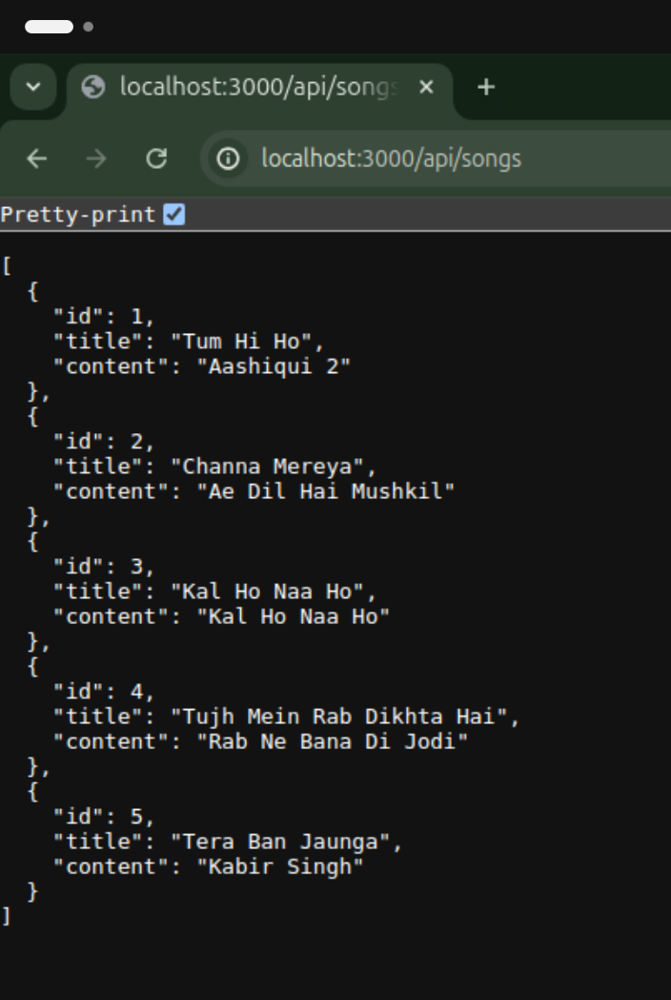
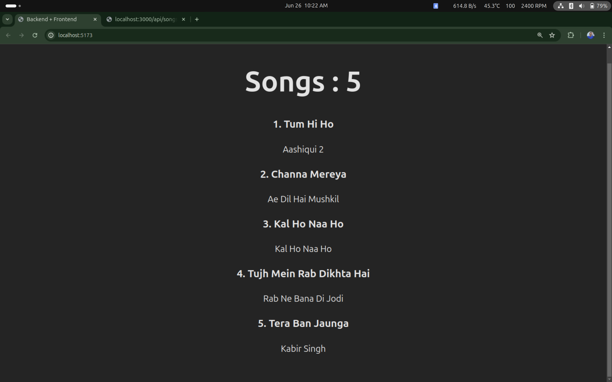

# Backend-Frontend Connection

This repository demonstrates a simple yet powerful connection between a backend server built with Express and a frontend interface created with React. The backend serves a collection of songs in JSON format, which the frontend fetches and displays.

## Backend

In the Backend folder, initialize npm and set up your project:

1. Initialize npm:
   ```bash
   npm init -y
   ```

2. Install Express:
   ```bash
   npm install express
   ```

3. Create a `server.js` file and set up your Express server:

   ```javascript
   import express from 'express';
   const app = express();
   
   const Songs = [
       {
           "id": 1,
           "title": "Tum Hi Ho",
           "content": "Aashiqui 2"
       },
       {
           "id": 2,
           "title": "Channa Mereya",
           "content": "Ae Dil Hai Mushkil"
       },
       {
           "id": 3,
           "title": "Kal Ho Naa Ho",
           "content": "Kal Ho Naa Ho"
       },
       {
           "id": 4,
           "title": "Tujh Mein Rab Dikhta Hai",
           "content": "Rab Ne Bana Di Jodi"
       },
       {
           "id": 5,
           "title": "Tera Ban Jaunga",
           "content": "Kabir Singh"
       }
   ];
   
   app.get('/api/songs', (req, res) => {
       res.send(Songs);
   });
   
   const port = process.env.PORT || 3000;
   app.listen(port, () => {
       console.log(`Server is running on port ${port}`);
   });
   ```

4. Update your `package.json` to include a start script:
   ```json
   "scripts": {
       "start": "node server.js"
   }
   ```

5. Start the server:
   ```bash
   npm run start
   ```

If everything is set up correctly, your terminal will display:
```bash
Server is running on port 3000
```
And the server will be accessible at:
```bash
http://localhost:3000/api/songs
```

### Displayed Songs Data

The songs data in JSON format will be served at the `/api/songs` endpoint.

## Browser Displayed Data

Here's the JSON data being displayed in the browser:



Now your server is ready to send data to the frontend!

## Frontend

1. Create a new React app in the Frontend folder:
   ```bash
   npm create vite@latest .
   npm install
   npm install axios
   npm run dev
   ```

2. In `App.js`, import necessary modules:
   ```javascript
   import React, { useEffect, useState } from 'react';
   import './App.css';
   import axios from 'axios';
   ```

3. Use `useState` to store the data:
   ```javascript
   const [songs, setSongs] = useState([]);
   ```

4. Fetch data from the backend:
   ```javascript
   useEffect(() => {
     axios.get('/api/songs')
       .then((res) => {
         console.log(res.data);
         if (Array.isArray(res.data)) {
           setSongs(res.data);
         } else {
           console.error('Data is not an array:', res.data);
         }
       })
       .catch((err) => {
         console.log('Error fetching songs:', err);
       });
   }, []);
   ```

5. Configure proxy in `vite.config.js`:
   ```javascript
   server: {
     proxy: {
       '/api': 'http://localhost:3000'
     }
   },
   ```

6. Use `map` function to display the data:
   ```javascript
   <h1>Songs : {songs.length}</h1>
   {songs.map((song, index) => (
     <div key={song.id}>
       <h3>{index + 1}. {song.title}</h3>
       <p>{song.content}</p>
     </div>
   ))}
   ```

Ensure the server is running and the frontend is able to fetch data from the backend. Run the frontend using:
```bash
npm run dev
```

### Frontend Output

Here's the output of the frontend:



Now you have a fully functional connection between your backend and frontend!